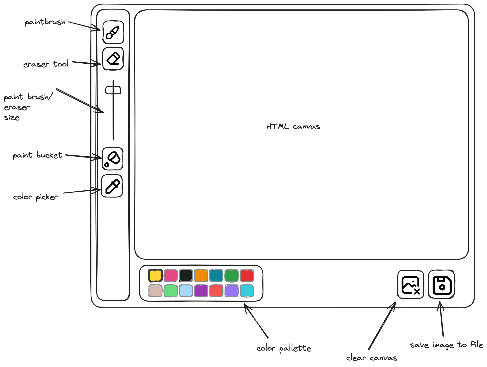

# Konzept

Das Konzept f&uuml;r das Abschlussprojekt des CIMDATA ECMA Script 1 Kurses.  
 
Name: Moriz Kr&auml;mer 
Projekt: Microsoft Paint Klon 
Verwendete Technologien: Javascript, Javascript Canvas, HTML, CSS  

### Kurzbeschreibung

Geplant ist die Umsetzung eines Microsoft Paint Klons, unter Verwendung des Javascript Canvas als Zeichenfl&auml;che. Es soll m&ouml;glich sein zwischen Pinsel, Radiergummi, Farbeimer und Pipette zu w&auml;hlen. Eine Farbpalette zum ausw&auml;hlen der verwendeten Farbe ist geplant. Es soll m&ouml;glich sein, die Kreation entweder als Datei herunterzuladen oder den Canvas zu l&ouml;schen.

#### weitere Ideen:

-   hintergrund w&auml;hlbar
-   Verschiedene Datetypen als Download
-   Rechteckwerkzeug
-   Kreiswerkzeug

 

## GUI Konzept

  
 

## Funktionen

### Pinsel
Der Pinsel w&auml;hlt malt eine Linie in der ausgew&auml;hlten Farbe und St&auml;rke auf die Leinwand.

##### Konzept:
Dies wird die Hauptaufgabe des Projektes. Entweder Benutzung der Draw-Line Funktion von canvas, oder zeichnen von Linien mit einer Reihe von Kreisen. Wahrscheinlich muss man einen Loop implementieren, in dem man, w&auml;hrend die linke Maustaste gedr&uuml;ckt ist, die Cursorposition abfragt.

##### Recherchen:
Canvas Draw-Path

 

### Radiergummi
Das Radiergummi ist eigentlich nur ein Pinsel mit weiss (oder der Hintergrundfarbe) voreingestellt.

##### Konzept:
siehe Pinsel

 

### Farbeimer
Der Farbeimer f&auml;rbt eine zusammenh&auml;ngende Fl&auml;che in der ausgew&auml;hlten Farbe. Der Farbeimer wird das letzte sein womit ich mich besch&auml;ftigen werde.

##### Konzept:
Man muss ausgehend von der geklickten Stelle alle Pixel auf die Farbe checken. Man muss sich &uuml;berlegen in welcher Form man dabei vorgehen m&ouml;chte.

##### Recherchen:
Funktion des Farbeimers in MS Paint. Recherche in git projekten von anderen JS paint Klonen.

 

### Strichst&auml;rke
Dieser Slider l&auml;sst den user die Strichst&auml;rke f&uuml;r den Pinsel und das Radiergummi ausw&auml;hlen.

##### Konzept:
Speichern des Wertes eines HTML inputs in einer Variable, zur Abfrage durch Pinsel und Radiergummi.

 

### Pipette
Die Pipette w&auml;hlt die angeklickte Farbe in der Farbpalette aus.

##### Konzept:
Checken der Farbe des Pixels unter dem Cursor und speichern in der ausgew&auml;hlten Farbe. Selektieren der Farbe in der Farbpalette.

 

### Farbpalette
Die Farbpalette l&auml;sst den Benutzer eine Farbe ausw&auml;hlen.

##### Konzept:
Ein array von Farbcodes, aus dem der User durch Klick auf eine Anzahl von Buttons eine Farbe ausw&auml;hlen kann. Diese Farbe wird in einer Variable gespeichert, und kann vom Pinsel und dem Farbeimer abgerufen werden.

 

### Bild l&ouml;schen
Der Knopf Bild l&ouml;schen l&auml;sst den Benutzer den Hintergrund auf die Hintergrundfarbe zur&uuml;ck setzen.

##### Konzept:
Den Canvas Hintergrund mit einer Farbe f&uuml;llen.

 

### Bild speichern
Dieser Knopf bietet das gemalte Bild als Datei zum herunterladen an.

##### Recherchen:
Wie speichert man die Canvas fl&auml;che als Datei

 
 

## Zeitplanung

-   Montag:
    -   Erstellung der Grundstruktur des Projektes (1h)
        -   erstellen von Ordnerstruktur
        -   Grundstruktur der app.js
        -   erstellen von Helferfunktionen
    -   implementieren der GUI in HTML und CSS. (3h)
    -   Recherche und experimentieren mit der Draw-Path Funktion von Canvas. (Rest des Tages)

-   Dienstag:
    -   implementieren der Farbpalette (1h)
    -   implementieren der Pinselfunktion (Rest des Tages)
    -   implementieren des Radiergummis (falls noch Zeit)

-   Mittwoch:
    -   implementieren des Radiergummis (1h)
    -   Recherche und implementieren von Bild l&ouml;schen und Bild speichern (2h)
    -   Recherche und implementieren der Pipette (2h)
    -   testen und Fehlerbehebung (Rest des Tages)
    -   Recherche und implementieren des Farbeimers (Rest des Tages)

-   Donnerstag:
    -   Recherche und implementieren des Farbeimers (all Day)
    -   eventueller Puffertag, falls kritische Funktionen nicht funktionieren
    -   testen in verschiedenen Browsern und Fehlerbehebung
    -   Vorbereitung der Pr&auml;sentation

-   Freitag:
    -   eventuelle Umsetzung weiterer Funktionen (all Day)
